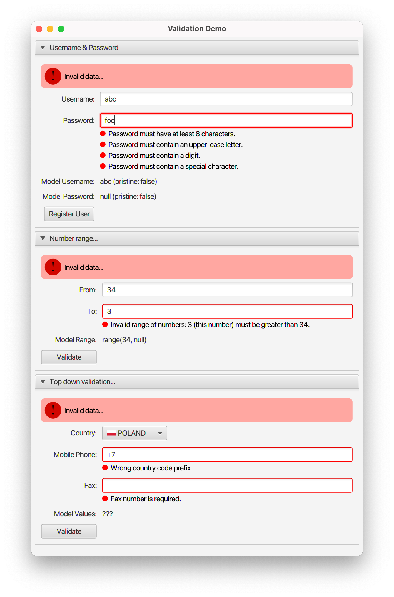
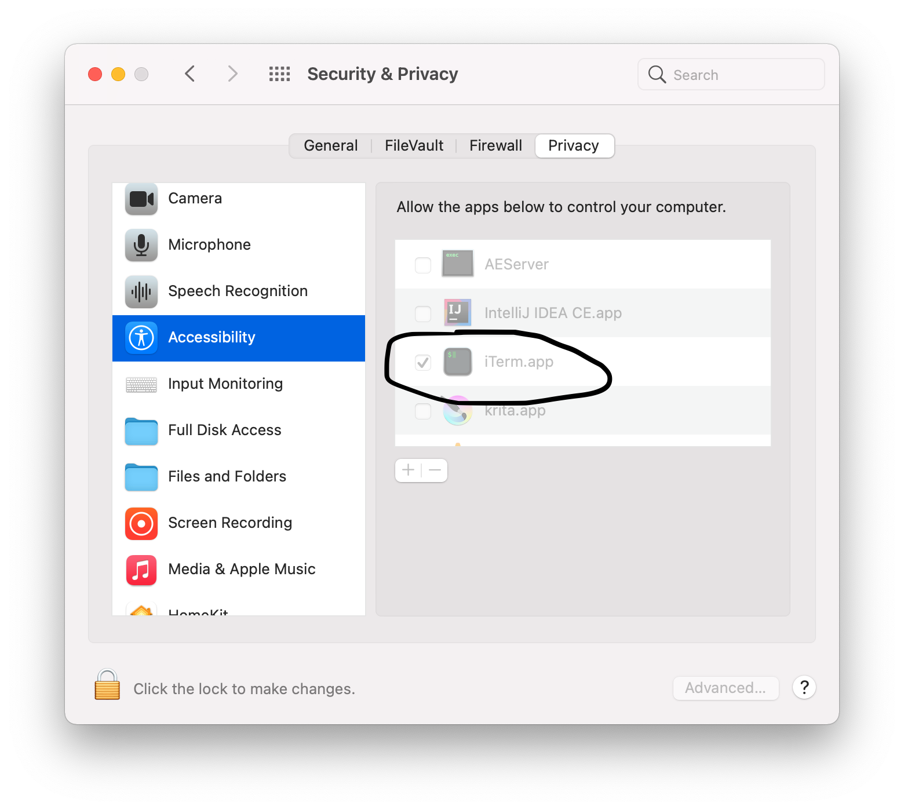

# JavaFX Validation Demo

This application shows how to implement simple validation in JavaFX from scratch.
By "simple", I mean that both debouncing and async-validators are not supported.
Support for them can be added with a bit of effort, 
but if you need them, then you will 
probably be better 
of using more advanced validation frameworks. In that case I can recommend checking out
[controlsfx](https://github.com/jinghai/controlsfx/blob/master/controlsfx-samples/src/main/java/org/controlsfx/samples/HelloValidation.java)
and [mvvmFX](https://github.com/sialcasa/mvvmFX/wiki/Validation) libraries.

This application comes in two parts. First we have of course the validation
library itself. Then we have three simple forms, with the most common
validation patterns, that demonstrate how to use
the library:


## Contributors Guide

### How to?

#### Run application
```
./mvnw javafx:run -pl demo
```

#### Regenerate scss styles
```
./mvnw nl.geodienstencentrum.maven:sass-maven-plugin:update-stylesheets -pl demo
```

#### Watch for SCSS changes and regenerate them
```
fswatch --exclude='.*' --include='.*[.]scss$' --print0 . | while read -d "" event; do
    ./mvnw nl.geodienstencentrum.maven:sass-maven-plugin:update-stylesheets -pl demo
done
```
You need to install `fswatch` command for this to work.

#### Generate `jlink` image (in `demo/target` directory):
```
./mvnw javafx:jlink -pl demo

./demo/target/validation-demo/bin/validation-demo
```
You can now send `./demo/target/validation-demo.zip` to your friends :tada:

#### Generate code quality reports
```
./mvnw clean verify site -Pstatic-analysis
```
Then open `./target/site/index.html` to see full report.

#### Run integration tests (TestFX)
```
./mvnw verify -Dskip.integration.tests=false -Dskip.unit.tests=true
```

Run in the headless mode (with screenshots):
```
_JAVA_OPTIONS="-Djava.awt.headless=true \
-Dtestfx.robot=glass \
-Dtestfx.headless=true \
-Dprism.order=sw \
-Dprism.verbose=true" ./mvnw verify -Dskip.integration.tests=false -pl demo
```

On macOS you must allow IntelliJ or the terminal app that you are using
to "take over your computer":



#### Generate aggregated Javadoc and Sources Jars
```
./mvnw clean package -Prelease-build
```

#### Publish artifact to MavenCentral

Set version:
```
mvn versions:set -DnewVersion=0.1-alpha-1
```
TODO: Create a branch and a tag.

Deploy:
```
./mvnw clean package deploy -Prelease-build
```

GPG Signing requires that you generated a GPG key and published it.
For more details see: https://central.sonatype.org/publish/requirements/gpg/.

I used the following `~/.m2/settings.xml` configuration:
```xml
<settings>
  <servers>
    <server>
      <id>ossrh</id>
      <username>sonatype-jira-user</username>
      <password>sonatype-jira-pass</password>
    </server>
  </servers>

  <profiles>
    <profile>
      <id>default</id>
      <activation>
        <activeByDefault>true</activeByDefault>
      </activation>
      <properties>
        <!-- on macOS -->
        <gpg.executable>/usr/local/bin/gpg</gpg.executable>
        <gpg.keyname>keyId</gpg.keyname>
        <gpg.passphrase>keyPass</gpg.passphrase>
      </properties>
    </profile>
  </profiles>
</settings>
```